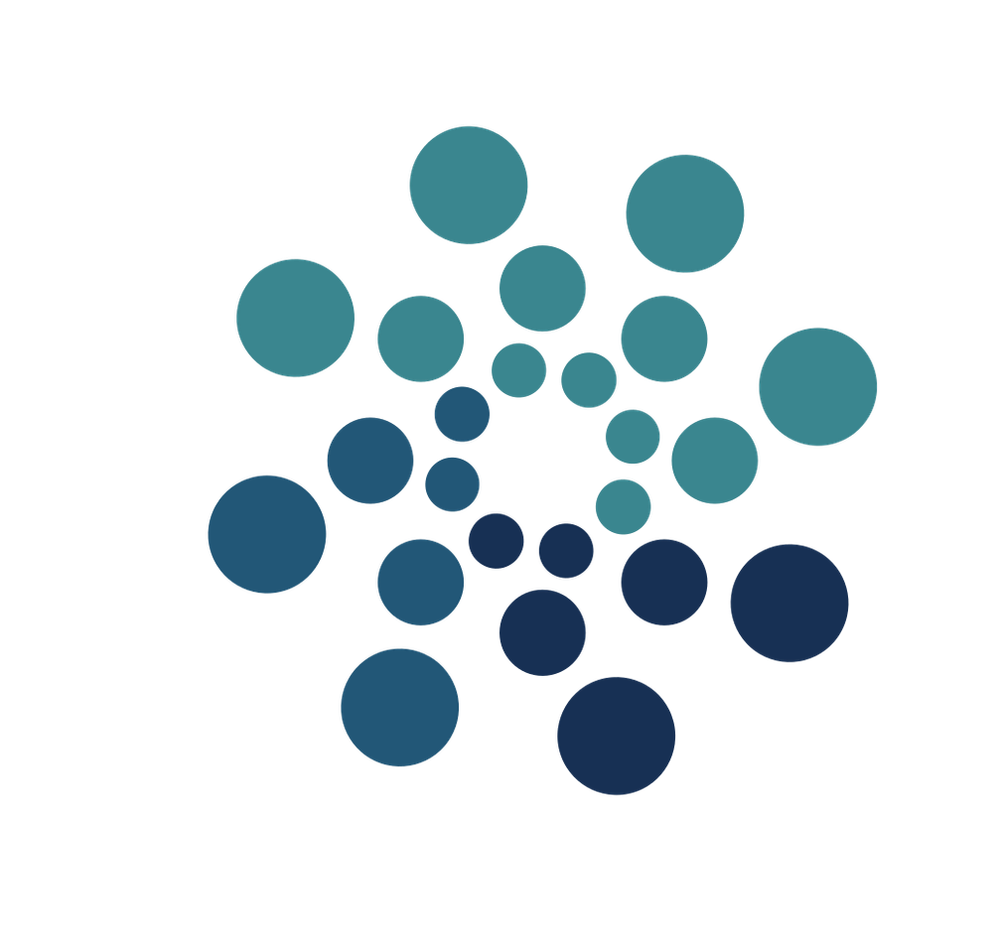

# NexoraAI - AI-Powered Content Creation Platform



NexoraAI is a comprehensive AI-powered content creation platform that provides users with a suite of intelligent tools to generate articles, create images, edit photos, and review resumes. Built with modern web technologies, it offers both free and premium tiers to cater to different user needs.

## 🚀 Features

### Content Creation Tools
- **AI Article Writer**: Generate high-quality, engaging articles on any topic with customizable length (500-1600+ words)
- **Blog Title Generator**: Create catchy, SEO-friendly blog titles across 17+ categories
- **AI Image Generation**: Transform text prompts into stunning AI-generated images

### Image Editing Tools
- **Background Removal**: Instantly remove backgrounds from photos with precision
- **Object Removal**: Seamlessly erase unwanted objects from images

### Professional Tools
- **Resume Reviewer**: Get AI-powered feedback on resumes for improved clarity and impact
- **Community Sharing**: Share and discover content created by other users

### User Management
- **Authentication**: Secure user authentication powered by Clerk
- **Usage Tracking**: Free tier with 10 generations, unlimited for Pro users
- **Dashboard**: Personal dashboard to manage and track all creations

## 🛠️ Technology Stack

### Frontend
- **React 19** - Modern UI library
- **Vite** - Fast build tool and development server
- **Tailwind CSS** - Utility-first CSS framework
- **React Router DOM** - Client-side routing
- **Clerk React** - Authentication and user management
- **Axios** - HTTP client for API requests
- **React Hot Toast** - Toast notifications
- **React Markdown** - Markdown rendering
- **Lucide React** - Beautiful icons

### Backend
- **Node.js** with **Express.js** - Server framework
- **OpenAI API** (via OpenRouter) - AI content generation
- **Neon Database** (PostgreSQL) - Cloud database
- **Cloudinary** - Image storage and processing
- **Clerk Express** - Backend authentication
- **Multer** - File upload handling
- **PDF Parse** - Resume parsing functionality

## 📁 Project Structure

```
NexoraAI/
├── client/                 # React frontend application
│   ├── src/
│   │   ├── components/     # Reusable UI components
│   │   ├── pages/          # Application pages
│   │   ├── assets/         # Static assets and data
│   │   └── main.jsx        # Application entry point
│   ├── public/             # Public assets
│   └── package.json        # Frontend dependencies
│
├── server/                 # Express.js backend
│   ├── config/             # Database and service configurations
│   ├── controllers/        # API route handlers
│   ├── middlewares/        # Custom middleware functions
│   ├── routes/             # API route definitions
│   └── server.js           # Server entry point
│
└── README.md               # Project documentation
```

## 🚦 Getting Started

### Prerequisites
- Node.js (v18 or higher)
- npm or yarn package manager
- Clerk account for authentication
- OpenRouter API key
- Neon Database account
- Cloudinary account

### Installation

1. **Clone the repository**
   ```bash
   git clone https://github.com/yourusername/NexoraAI.git
   cd NexoraAI
   ```

2. **Install dependencies**
   ```bash
   # Install server dependencies
   cd server
   npm install
   
   # Install client dependencies
   cd ../client
   npm install
   ```

3. **Environment Setup**
   
   Create `.env` file in the server directory:
   ```env
   DATABASE_URL=your_neon_database_url
   OPENROUTER_API_KEY=your_openrouter_api_key
   CLERK_SECRET_KEY=your_clerk_secret_key
   CLOUDINARY_CLOUD_NAME=your_cloudinary_cloud_name
   CLOUDINARY_API_KEY=your_cloudinary_api_key
   CLOUDINARY_API_SECRET=your_cloudinary_api_secret
   PORT=8888
   ```
   
   Create `.env` file in the client directory:
   ```env
   VITE_CLERK_PUBLISHABLE_KEY=your_clerk_publishable_key
   VITE_BASE_URL=http://localhost:8888
   ```

4. **Database Setup**
   - Set up your Neon PostgreSQL database
   - Create the required tables (creations table for storing user content)

5. **Run the application**
   ```bash
   # Start the server (from server directory)
   npm run start
   
   # Start the client (from client directory)
   npm run dev
   ```

6. **Access the application**
   - Frontend: `http://localhost:5173`
   - Backend API: `http://localhost:8888`

## 💡 Usage

1. **Sign Up/Login**: Create an account or sign in using Clerk authentication
2. **Choose a Tool**: Select from the available AI tools on the dashboard
3. **Generate Content**: Input your requirements and let AI create content for you
4. **Manage Creations**: View, edit, and share your creations from the dashboard
5. **Upgrade Plan**: Access unlimited generations with the Pro plan

## 🔧 API Endpoints

### AI Routes (`/api/ai`)
- `POST /generate-article` - Generate articles
- `POST /generate-blog-title` - Generate blog titles
- `POST /generate-image` - Generate AI images
- `POST /remove-image-background` - Remove image backgrounds
- `POST /remove-image-object` - Remove objects from images
- `POST /resume-review` - Review resumes

### User Routes (`/api/user`)
- `GET /get-user-creations` - Fetch user's creations
- `GET /get-published-creations` - Fetch community content

## 🎯 Key Features for Recruiters

- **Full-Stack Development**: Demonstrates proficiency in both frontend and backend technologies
- **Modern Tech Stack**: Uses current industry-standard tools and frameworks
- **Authentication & Authorization**: Implements secure user management with Clerk
- **Database Integration**: PostgreSQL with Neon cloud database
- **API Integration**: Multiple third-party service integrations (OpenAI, Cloudinary)
- **File Handling**: Image and PDF processing capabilities
- **Responsive Design**: Mobile-first, responsive user interface
- **State Management**: Proper React state management and data flow
- **Error Handling**: Comprehensive error handling and user feedback
- **Scalable Architecture**: Well-organized, maintainable code structure

## 📧 Contact

For any questions or inquiries, please reach out through the contact information provided in the application.

---

**Built with ❤️ using React, Node.js, and AI technologies**